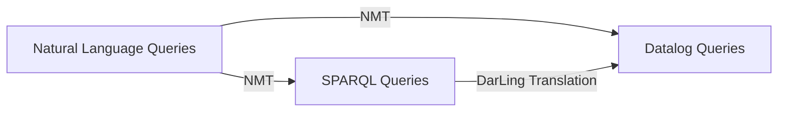
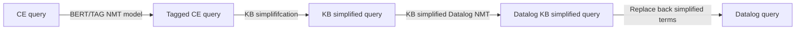

# An interface between English and Datalog
**Yvann Le Fay**, Intern @MIND team, INRIA
Supervised by **Demian WASSERMANN, Ph.D.**
## An exploratory project to facilitate the use of Datalog
We briefly introduce what Datalog is and what are our translation objectives.

### Introduction to Datalog
Datalog is a declarative logic programming language. It is mainly used to construct deductive databases.

From **facts** stored in database tables, and **rules**, written as a Datalog program, Datalog's first-order logic engine enriches the database of the inferred facts. At first order, one could describe datalog as *SQL with recursion*. 

An example that epitomizes the principle of Datalog is the following one:

Given the following **facts**, that are part of the extensional database:
- ```parent("Wolfgang Amadeus", "Franz Xaver Wolfgang")```
- ```parent("Leopold", "Wolfgang Amadeus")```

and the following **rules**:
- ```ancestor(A, B) :- parent(A, B)```
- ```ancestor(A, B) :- parent(A, C), ancestor(C, B)```

We can deduce the **inferred facts** or the **derived tables**, which constitute the intentional database:
- ``` ancestor("Leopold", "Franz Xaver Wolfgang")```
- ``` ancestor("Leopold", "wolfgang Amadeus")```
- ```ancestor("Wolfgang Amadeus", "Franz Xaver Wolfgang")```


The interested reader is referred to this comprehensive  [survey](https://ieeexplore.ieee.org/document/8186829) on Datalog for a detailed description of the fields of application of Datalog, the Datalog recursion engine as well as the different classes of requests.

This note is *not* about the inner workings of Datalog.
### Objectives and examples of requests
We would like to be able to formulate Datalog requests using English sentences. Examples of requests we would like to map to a Datalog program taken from the [LC-QuAD 1.0 database](http://lc-quad.sda.tech/lcquad1.0.html) are:
"Which *office*'s people have died on the *US Route 165*?"
"List the *institute* of *Robert hall*"
"Who was the *writer* of the *novel* *Maniac Magee*?"
"Name the series of *Doctor Who: Evacuation Earth* ?"

The terms made in italic refer to specific terms that must be defined in the extensional or intensional databases. In this case, the LC-QuAD 1.0 requests are linked to the [DBPedia knowledge base](https://dbpedia.org/page/). Hence, those terms are specific to this knowledge base. We will denote those terms as knowledge-base-specific terms (KB-specific terms). 

The corresponding Datalog requests for the previous examples are:
```ans(uri) :- <http://dbpedia.org/ontology/Person>(x),<http://dbpedia.org/property/office>(x,uri),<http://dbpedia.org/property/deathPlace>(x,\"http://dbpedia.org/resource/U.S._Route_165\").```

```ans(uri) :- <http://dbpedia.org/ontology/institution>(\"http://dbpedia.org/resource/Robert_Hall_(economist)\",uri).```

```ans(uri) :- <http://dbpedia.org/ontology/Writer>(uri),<http://dbpedia.org/property/notableworks>(uri,\"http://dbpedia.org/resource/Maniac_Magee\").```

```ans(uri) :- <http://dbpedia.org/ontology/series>(\"http://dbpedia.org/resource/Doctor_Who:_Evacuation_Earth\",uri).```

Please notice how the mapping of the KB-specific terms between the English sentence and the corresponding datalog query is not trivial. This shift between English and Datalog KB terms alone constitutes a thorny issue we will have to deal with.

To simplify the translation problem, we will consider intermediary English sentences that are available in the LC-QuAD database : 

"What is the <institution> of <Robert Hall (economist)> ?"
"What is the <office> of the <mayors> whose <POD> is <U.S. Route 165>?"
"What <writer>'s <notableworks> is <Maniac Magee> ?"
"What is the <series> of <Doctor Who: Evacuation Earth> ?"
    
Those sentences are simpler for four reasons:
- In the intermediary English question, the KB-specific terms are tagged between brackets. However, we shall be able to formulate intermediary English questions with no bracket.
- The KB-specific terms are closer to their mention in the KB database than in the initial sentence. For example, *Robert hall* is *Robert hall (economist)*, which is closer to the exact mention in the datalog query (```resource/Robert_Hall_(economist)```).  However, they are not necessarily the same, for example in the second request, *POD* is mapped to ```property/deathPlace```. This issue is the shift between English and Datalog KB-specific terms, this is known as the entity-matching problem.
- It contains needed mentions to the KB database to solve it. In the third example, unlike in the intermediary question, the initial question contains no mention of ```property/notableworks```, which is needed to compute the conjunctive query between *writer* and *notableworks*. This issue is a misspecification of the English request, in the sense that there are some implicit information about the KB that are needed to map the English query to its Datalog version.
- The question is part of a subset of standard English that can be described with simple restricted syntax and semantics. Intermediary English and Controlled English both refer to the same thing.
    
The intermediary question solves the misspecification issue and mitigates the entity matching issue. A solution for both, is to embed the knowledge graph in a latent space, please see the article of Gael Varoquaux on [relational data embeddings](https://link.springer.com/article/10.1007/s10994-022-06277-7). The solution combines both the entity embedding and the embedding of the relations between entities.
    
Formally, the problem we are facing is finding a mapping between dd English requests with mention to specific knowledge databases with no prior information on it, and the corresponding Datalog query/program. In this work, we restrict ourselves to requests in LC-QuAD 1.0 in the Controlled English setup.

### Two main approaches: A deterministic mapping defined by a small set of rules and implicit Neural Machine mapping using NLP models.
    
**The first approach** is directly inspired by the work of Sébastien Ferré : [SQUALL: The expressiveness of SPARQL 1.1 made available as a controlled natural language.](https://hal.inria.fr/hal-01100300) SPARQL is similar to Datalog but its semantics has an overall complexity larger than Datalog. 
In this approach, every English question is part of the set of SQUALL sentences, where every KB-specific term are seen as a variable. 
This note is not about this solution. 


**The second approach** is to adhere to the unreasonable performances of Machine Learning in the field of translation. We consider the pair Controlled English/Datalog language as a pair of foreign languages and we apply the [Seq2Seq NLP model](https://ai.googleblog.com/2017/07/building-your-own-neural-machine.html). 
    
## The neural machine translation solutions
First, we deal with the creation of the needed English/Datalog database to do supervised NLP learning, by using a SPARQL query rewriter called DaRLing and applying it to the existing SPARQL LC-QuAD database. 
    
Then, we discuss the naive approach consisting of directly applying the Seq2Seq model on the database, as it has been done in [SPARQL Seen as a Foreign Language](https://arxiv.org/abs/1708.07624), which leads to the incapacity of the model to treat any request that contains mentions to Knowledge-Base terms it has not been trained on.

Finally, we propose a pipeline that consists in simplifying the requests by replacing KB-specific terms with variables and then learning from those simplified requests. We leverage the [BERT Part-of-Speech tags](https://huggingface.co/QCRI/bert-base-multilingual-cased-pos-english) to automatically detect KB-specific terms. This approach mitigates the previous issue. However, it does not solve the KB-related shift.
    
As a closing remark, the NMT predictions do not necessarily meet the Datalog syntax which greatly hinders the use of NMT model. We have not investigated this issue.

### Creating the database from English/SPARQL databases using DarLing
To apply any NMT solution to our problem, we first need a database with controlled English queries and their corresponding Datalog queries. However, the LC-QuAD 1.0 database is a SPARQL database and no such database has been found. We have to create it.

We use [DaRLing: a Datalog OWL 2 RL Rewriter](https://arxiv.org/abs/2008.02232), a Perl-script, available [here](https://demacs-unical.github.io/DaRLing/), that enables us to convert OWL ontology and a subset of the possible SPARQL requests to its corresponding Datalog program. 
    

    
Currently, every SPARQL request that contains "ASK" are not correctly translated, hence we ignore those requests. Overall, the database lacks diversity: no aggregation other than count.
    
Some examples of the LC-QuAD database enriched with the Datalog queries are:
    

```
"_id": "240",
"corrected_question": "What genre of games are made by Blizzard Entertainment studios?",
"intermediary_question": "What is the <kind of music> of the <video games> whose <developed by> is <Blizzard Entertainment>?",
"sparql_query": "SELECT DISTINCT ?uri WHERE { ?x <http://dbpedia.org/ontology/developer> <http://dbpedia.org/resource/Blizzard_Entertainment> . ?x <http://dbpedia.org/property/genre> ?uri  . ?x <http://www.w3.org/1999/02/22-rdf-syntax-ns#type> <http://dbpedia.org/ontology/VideoGame>}",
"sparql_template_id": 305,
"datalog_query": "ans(uri) :- <http://dbpedia.org/ontology/VideoGame>(x),<http://dbpedia.org/property/genre>(x,uri),<http://dbpedia.org/ontology/developer>(x,\"http://dbpedia.org/resource/Blizzard_Entertainment\")."
```
```
"_id": "3557",
"corrected_question": "What are the awrds won by Laemmle Theatres ?",
"intermediary_question": "What is the <service> of <Laemmle Theatres> ?",
"sparql_query": " SELECT DISTINCT ?uri WHERE { <http://dbpedia.org/resource/Laemmle_Theatres> <http://dbpedia.org/ontology/service> ?uri } ",
"sparql_template_id": 2,
"datalog_query": "ans(uri) :- <http://dbpedia.org/ontology/service>(\"http://dbpedia.org/resource/Laemmle_Theatres\",uri)."
```

### The naive approach
In [SPARQL Seen as a Foreign Language](https://arxiv.org/abs/1708.07624), the authors create a training database using ontology-specific templates and apply the Seq2Seq model on it. Their implementation is available at [NSpM](https://github.com/LiberAI/NSpM/tree/v1). 
    
While we obtain a relatively high [BLEU](https://en.wikipedia.org/wiki/BLEU)-score metrics (0.80) on the [DBPedia ontology Monument](https://dbpedia.org/ontology/Monument), the model is not able to incorporate KB-specific terms it has not been trained on. The following example epitomizes the issue we are dealing with:

Asking the NSpM model, trained on the Monument database, 
    "Where is the *Arc de Triomphe* located in ?"
leads to the following Datalog prediction:
```
<https://dbpedia.org/ontology/location>(\"https://dbpedia.org/resource/L._I._Geltischeva_Mansion\",a).
```
The same problem occurs in the SPARQL prediction.   
    
Indeed, *L. I. Geltischeva Mansion* is part of the vocabulary of the model while *Arc de Triomphe* is not.
    
Instead, we want the NMT model to focus on the shift between the controlled English semantics and the Datalog semantics not on the translation of the KB-specific terms. Hence, we simplify the requests by replacing KB-specific terms with variables.
    
### Learning with Knowledge-Base simplified requests
Given a pair $(E, D)$ of a controlled English request and its corresponding Datalog query, for each term $t$ in the set $KB(E)$ of knowledge-base-specific terms in the English request, i.e if the request is tagged, every term in brackets, we replace $t$ by a generic unused symbol $A$, $B$, ... We denote this mapping by $f:KB(E)\to\{A, B, ...\}$. The set $f(KB(E))$ is the set of all distinct generic symbols that appear in the simplified English query. By construction, $f$ is bijective when restricted to $f(KB(E))$.
    
Then for each term $t$ in the KB-specific terms in the Datalog request, $KB(D)$, $t$ is of the form $`dbpedia.org/`X`/`h$ where $X\in\{`ONTOLOGY`,`RESOURCE`, `PROPERTY`\}$.
We define the replace mapping for the Datalog query:
    $$g : KB(D)\to \bigcup_{s\in f(KB(E))}\{`ONTOLOGY\_`s,`RESOURCE\_`s, `PROPERTY\_`s\}$$
by 
    $$g(`dbpedia.org/`X`/`h) = X`\_`f(argmin_{t\in KB(E)}d(t, h))$$
    
where $d$ is an editing distance, let it be the Levenshtein distance. The previous examples taken from the LC-QuAD converted database become:

```  
"_id": "240",
"intermediary_question": "What is the <A> of the <B> whose <C> is <D>?",
"sparql_query": "SELECT DISTINCT ?uri WHERE { ?x <dbo_C> <dbr_D> . ?x <dbp_B> ?uri  . ?x <http://www.w3.org/1999/02/22-rdf-syntax-ns#type> <dbo_B>}",
"datalog_query": "ans(uri) :- <dbo_B>(x),<dbp_B>(x,uri),<dbo_C>(x,\"dbr_D\")."
```
```    
"_id": "3557",
"intermediary_question": "What is the <A> of <B> ?",
"sparql_query": " SELECT DISTINCT ?uri WHERE { <dbr_B> <dbo_A> ?uri } ",
"datalog_query": "ans(uri) :- <dbo_A>(\"dbr_B\",uri)."
```

We then learn on the KB-simplified training database.
    
The BLEU scores do not increase much with respect to the size of the training database because the simplified training database is a lot redundant. Moreover, the correct metric should be the hit-ratio defined as the ratio between the number of correctly predicted simplified requests and the size of the database. 
    
    
Notice that given $f$ and $g$, we can invert both operations. However, to have $g$, we must have the Datalog request $D$. Hence, when predicting the Datalog request given the English request $E$, we only have access to the mapping $f$ and we won't necessarily be able to exactly map each generic symbol occurring in the predicted Datalog request to the corresponding term of the form $`dbpedia.org/`X`/`h$, that is due to the KB-related shift. Moreover, while predicting $h$ is clearly part of the entity-matching issue, the following simplified queries show that predicting $X$ is also part of the entity-matching: 
    
```
"_id": "589",
"intermediary_question": "What is the <A> of <B> ?",
"sparql_query": " SELECT DISTINCT ?uri WHERE { <dbr_B> <dbo_A> ?uri } ",
"datalog_query": "ans(uri) :- <dbo_A>(\"dbr_B\",uri)."
```
    
```
"_id": "1600",
"intermediary_question": "What is the <A> of <B> ?",
"sparql_query": " SELECT DISTINCT ?uri WHERE { <dbr_B> <dbp_A> ?uri } ",
"datalog_query": "ans(uri) :- <dbp_A>(\"dbr_B\",uri)."
```
However, we decide to keep $X$ in the simplified query and try to predict it. Moreover, we make the unique-name assumption and hence replace each term of the form $\hat{X}`\_`\hat{G}$ in the predicted Datalog query, where $\hat{G}$ is a generic symbol, by $`dbpedia.org/`\hat{X}`/`f^{-1}(\hat{G})$.
    
### Automatically detect Knowledge-Base terms
To simplify the input controlled English question, we must detect knowledge-base-specific terms. To do that, we leverage the [BERT Part-of-Speech tagging model](https://huggingface.co/QCRI/bert-base-multilingual-cased-pos-english). 

Given an English question with KB terms tagged in brackets, the BERT POS model output is the sequence of the grammatical classes for each word in the question. For example:
```
"intermediary_question": "What <city>'s <founded by> is <John Forbes (British Army officer)>",
"intermediary_question_no_br": "What city's founded by is John Forbes (British Army officer)",
"BERT_POS": "WP NN VBZ VBZ VBN IN VBZ NNP NNP -LRB- NNP NNP NN -RRB-",
"_id": "2586"
```

For each token in the POS sequence, we assign a corresponding knowledge-base tag. The sequence of KB tags entails the needed information to put back the brackets, i.e, to detect the KB-specific terms. The knowledge-base tags are the following ones:

| Abbreviated tag | Tag  |         Corresponds to a token          |
|:----------------:|:-----:|:---------------------------------------:|
|        N         |  No   |         that is not KB-specific         |
|        O         | Open  |   that starts a KB-specific sequence    |
|        E         |  End  |      that ends a KB-specific seq.       |
|        B         | Both  | that starts and ends a KB-specific seq. |
|        I         | Inner |    that is inside a KB-specific seq.    |

In the previous example, the KB-tags sequence is 
```
"BR_TAGS": "N B N N O E N O I I I I I E",
"_id": "2586"
```

The set of those classes has a cardinal of $30$ while the set of KB tags has $5$ elements. We make the reasonable assumption that given a POS sequence, we shall be able to reconstruct the KB-tags sequence, using the Seq2Seq model.

This assumption is reinforced by the high BLEU score (98.9).
    
 
    
We consider the hit ratio between the tagged questions in the LC-QuAD database and the reconstructed tagged question.


### The final pipeline
Given an input controlled English question, we apply the following procedure:
    
- Simplify it by using the (POS tags, KB tags) model.
- Use the (Simplified English questions, SPARQL/Datalog simplified queries) model to predict - the simplified query.
- Replace back the simplified terms under the unique-name assumption.


    

### An example
This example is taken from the LC-QuAD database (request n. 1579):

The input question is: ```"What is the alumnus of of the fashion designer whose death place is Stony Brook University Hospital ?"```
The output of the BERT model is:
```WP VBZ DT NN IN IN DT NN NN WP$ NN NN VBZ NNP NNP NNP NNP .```
Which leads to the following KB tags:
```N N N O E N N O E N O E N O I I E N```
And the following KB-simplified query:
```"What is the <A> of the <B> whose <C> is <D> ?"```
The predicted KB-simplified Datalog query is:
```ans(uri) :- <https://dbpedia.org/ontology/B>(x),<https://dbpedia.org/ontology/A>(x,uri),<https://dbpedia.org/ontology/C>```
The inverse mapping $f^{-1}$ is given by 
    ```{'A': 'alumnus_of', 'B': 'fashion_designer', 'C': 'death_place', 'D': 'Stony_Brook_University_Hospital'}```
And the predicted datalog query is:
```ans(uri) :- <https://dbpedia.org/ontology/fashion_designer>(x),<https://dbpedia.org/ontology/alumnus_of>(x,uri),<https://dbpedia.org/ontology/death_place>```
The correct datalog query is:
```ans(uri) :- <http://dbpedia.org/ontology/FashionDesigner>(x),<http://dbpedia.org/property/education>(x,uri),<http://dbpedia.org/ontology/deathPlace>(x,\"http://dbpedia.org/resource/Stony_Brook_University_Hospital\").```

# Repository and references
    
The implementation of the full pipeline is available at [github/hallelujahylefay/NMT_SparqlDatalog](https://github.com/hallelujahylefay/NMT_SparqlDatalog/).

---
    
Todd J. Green; Shan Shan Huang; Boon Thau Loo; Wenchao Zhou, [Datalog and Recursive Query Processing](https://ieeexplore.ieee.org/document/8186829), 2013. 
    
Trivedi Priyansh; Maheshwari Gaurav; Dubey Mohnish; Lehmann Jens, [Lc-quad: A corpus for complex question answering over knowledge graphs](http://lc-quad.sda.tech/lcquad1.0.html), Proceedings of the 16th International Semantic Web Conference (ISWC), 2017, pp.210 - 218.
    
Alexis Cvetkov-Iliev; Allauzen, Alexandre; Gael Varoquaux. [Relational data embeddings for feature enrichment with background information](https://doi.org/10.1007/s10994-022-06277-7). Mach Learn 112, 687–720 (2023).     

Sébastien Ferré. SQUALL: [The expressiveness of SPARQL 1.1 made available as a controlled natural language](https://hal.inria.fr/hal-01100300). Data and Knowledge Engineering, 2014, 94, pp.163 - 188. ⟨10.1016/j.datak.2014.07.010⟩. ⟨hal-01100300⟩


Minh-Thang Luong; Eugene Brevdo; Rui Zhao, [Neural Machine Translation (seq2seq) Tutorial](https://github.com/tensorflow/nmt), 2017.
    
Alessio Fiorentino; Jessica Zangari; Marco Manna, [DaRLing: A Datalog rewriter for OWL 2 RL ontological reasoning under SPARQL queries](https://arxiv.org/abs/2008.02232),   Theory and Practice of Logic Programming, 2020, 20, pp.958 - 973
    
Hassan Sajjad; Nadir Durrani; Fahim Dalvi; Firoj Alam; Abdul Rafae Khan; Jia Xu, Analyzing Encoded Concepts in Transformer Language Models, North American Chapter of the Association of Computational Linguistics: Human Language Technologies (NAACL), NAACL~'22, 2022